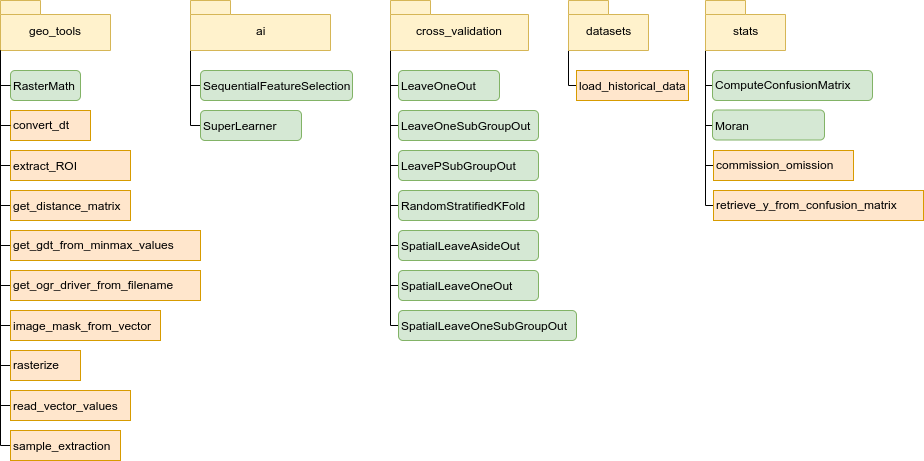

# Summary

``Museo ToolBox`` is a python library directly built open the famous raster library GDAL.
In remote sensing, especially in machine learning, the majority of the work require efficient and use always the same base code (e.g., for reading and writing the raster block per block).
As in our field the most usage is to (each line corresponds to a pixel, and each columns to a feature/raster band).

The machine learning part is natively built to manage algorithm
from the ``scikit-learn`` using state of the art methods and good pratices (such as standardizing the input data).

 1. Reading and writing the raster band per band using your own function.
 2. Create cross-validation, including spatial cross-validation.
 3. Learn with scikit-learn models and extract accuracy from each cross-validation fold.
 4. Save the cross-validation in spatial vector files (shp, gpkg, sqlite...).
 5. Plot confusion matrix easily and add f1 score or producer/user accuracy.
 6. Retrieve easily the true and predicted label from a confusion matrix.

# RasterMath

Special part on RasterMath
Functionnality and why it is some much useful.

# Spatial cross-validation

``Museo ToolBox`` produces only stratified cross-validation, which means the split is made by class.
For example, using the Leave-One-Out one sample per class, and not one sample for all your samples.

- Spatial Leave-One-Out Method [@lerest_2013,@karasiak_2019]
- Spatial Leave-Aside-Out [@engler_2013]
- Spatial Leave-One-SubGroup-Out

# Figures

A short uml...

